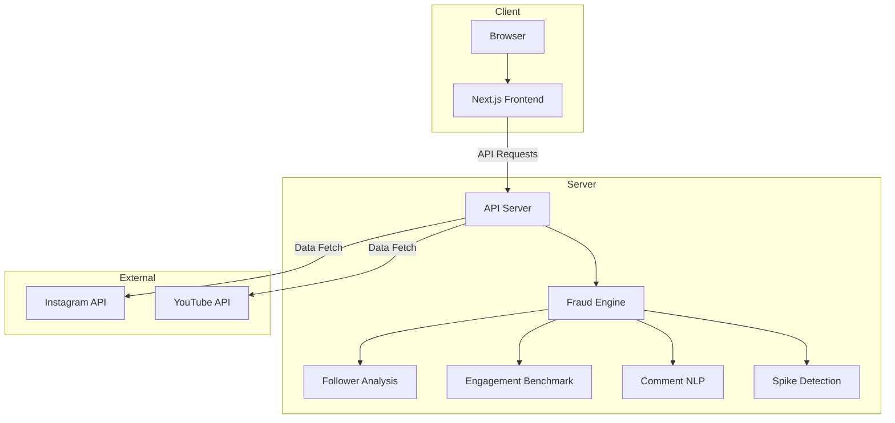
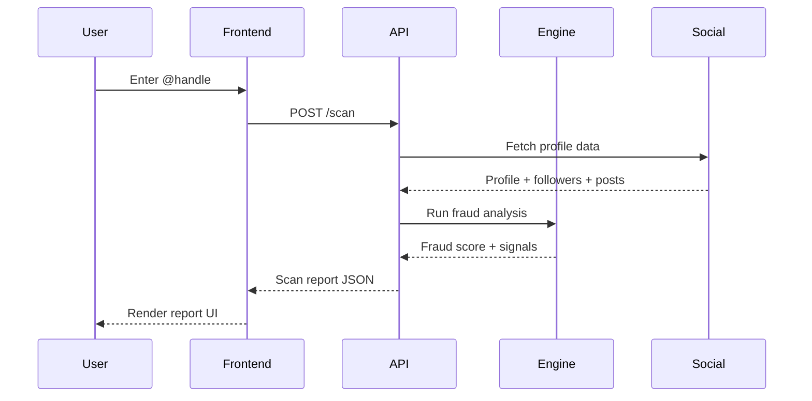

# SpotBot — Architecture Overview

This document provides a high-level overview of the SpotBot project architecture.

## Repository Structure

SpotBot follows a monorepo structure with clearly separated concerns:

```
Spotbot2/
├── frontend/          → Next.js landing page & web application
├── backend/           → API server & fraud detection engine
├── docs/              → Project documentation
└── .github/workflows/ → CI/CD pipelines
```

## System Architecture



## Frontend

**Stack**: Next.js, React, TypeScript, Tailwind CSS, Framer Motion

The frontend is a marketing landing page that showcases SpotBot's capabilities. It includes:

- **Interactive demo** — Live fraud scan simulation
- **Fraud model explainer** — How the multi-signal analysis works
- **Pricing** — Self-serve pricing tiers
- **FAQ** — Common questions from agencies

### Component Architecture

```
components/
├── layout/       → Persistent UI (Navbar, Footer)
├── sections/     → Page sections (Hero, Demo, Pricing, etc.)
└── ui/           → Reusable UI primitives (buttons, cards, etc.)
```

## Backend

**Stack**: Node.js, TypeScript (framework TBD)

The backend will provide the fraud detection API. It is currently a scaffold with the following planned modules:

| Module | Purpose |
|---|---|
| **Routes** | REST API endpoints for scans, reports, and auth |
| **Fraud Engine** | Multi-signal fraud score computation |
| **Data Ingestion** | Social media API integrations |
| **Config** | Environment variables and feature flags |

## Fraud Detection Model

SpotBot's fraud score is computed from four independent signals:

1. **Follower Growth Velocity** — Detects sudden spikes from purchased followers
2. **Engagement Rate Benchmark** — Compares against verified peers in the same niche
3. **Comment Sentiment Analysis** — NLP-based detection of bot comment patterns
4. **Spike Anomaly Detection** — Cross-references follower bursts with posting activity

Each signal produces a sub-score. The final fraud score (0–100) is a weighted composite, where 60+ indicates high risk.

## Data Flow


