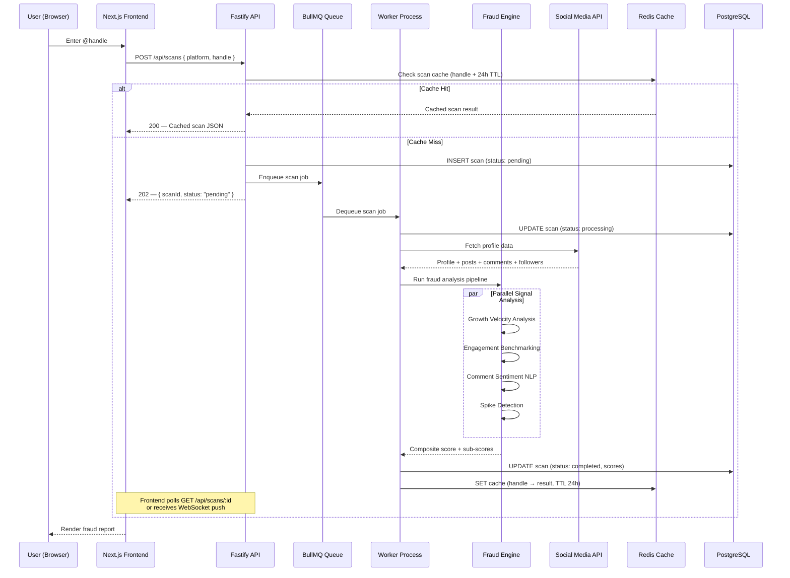
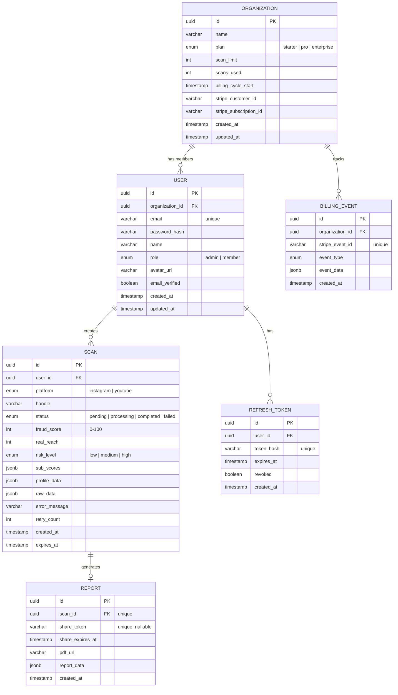
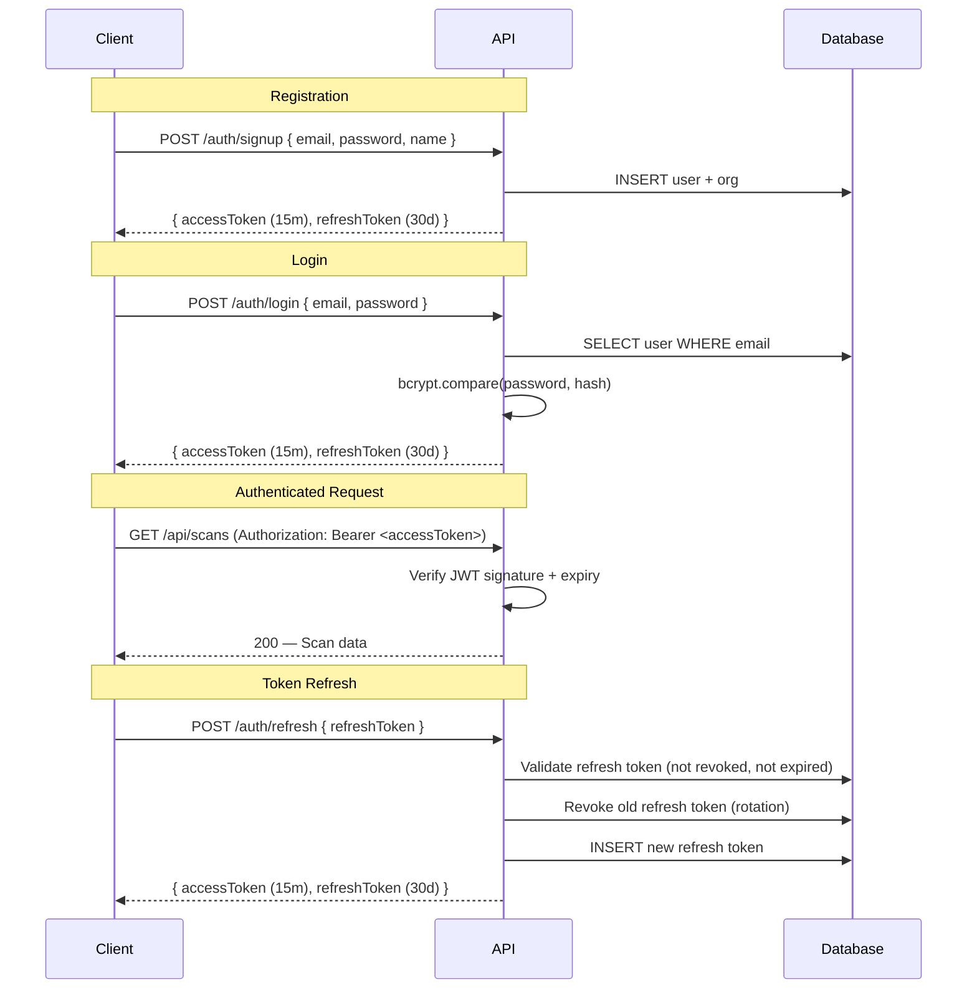
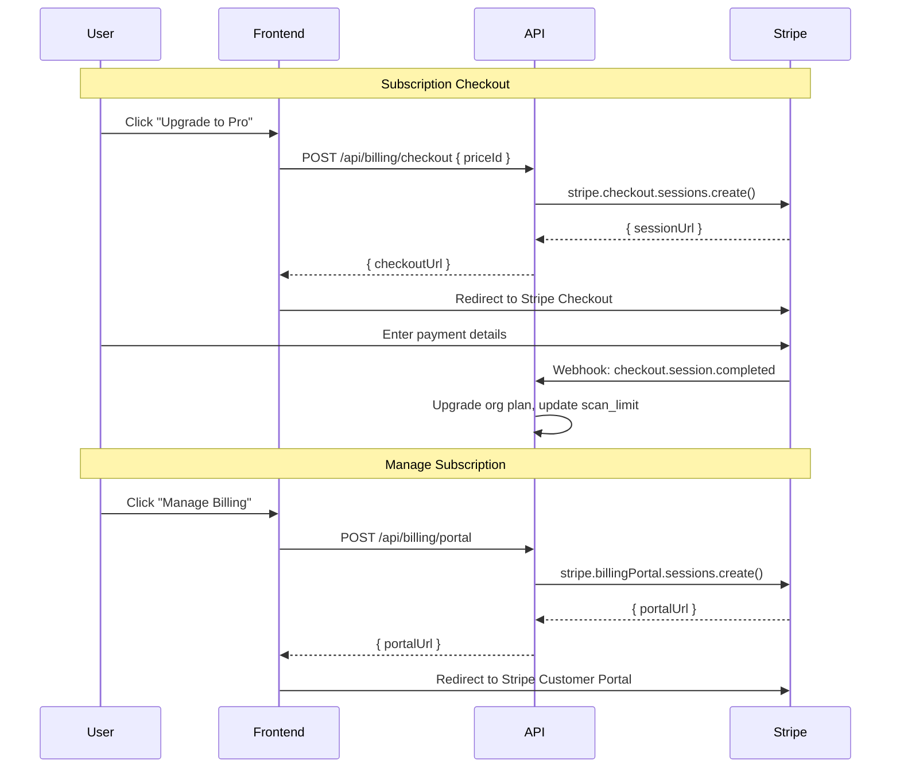

# Spotbot — Technical Specification

> Derived from [idea.md](file:///c:/Users/nilak/OneDrive/Desktop/Spotbot2/docs/idea.md) and [requirements.md](file:///c:/Users/nilak/OneDrive/Desktop/Spotbot2/docs/requirements.md)  
> Last updated: June 2026

---

## Table of Contents

1. [System Architecture](#1-system-architecture)
2. [Technology Stack](#2-technology-stack)
3. [Repository Structure](#3-repository-structure)
4. [Backend Specification](#4-backend-specification)
5. [Frontend Specification](#5-frontend-specification)
6. [Database Design](#6-database-design)
7. [Fraud Detection Engine](#7-fraud-detection-engine)
8. [API Contract](#8-api-contract)
9. [Authentication & Authorization](#9-authentication--authorization)
10. [Billing & Payments](#10-billing--payments)
11. [Infrastructure & Deployment](#11-infrastructure--deployment)
12. [Security Specification](#12-security-specification)
13. [Performance & Scalability](#13-performance--scalability)
14. [Observability & Monitoring](#14-observability--monitoring)
15. [Testing Strategy](#15-testing-strategy)
16. [Error Handling & Resilience](#16-error-handling--resilience)
17. [Implementation Roadmap](#17-implementation-roadmap)
18. [Technical Decisions & Trade-offs](#18-technical-decisions--trade-offs)

---

## 1. System Architecture

### 1.1 High-Level Overview

Spotbot follows a **client-server monorepo architecture** with a Next.js frontend, a Node.js API backend, a PostgreSQL database, Redis for caching and job queues, and an isolated fraud analysis engine.

```
┌─────────────────────────────────────────────────────────────────────┐
│                           CLIENT LAYER                              │
│                                                                     │
│   ┌───────────────────────────────────────────────────────────┐     │
│   │              Next.js Frontend (Vercel)                    │     │
│   │  ┌─────────┐  ┌──────────┐  ┌──────────┐  ┌──────────┐  │     │
│   │  │ Landing  │  │   Auth   │  │Dashboard │  │  Report  │  │     │
│   │  │  Page    │  │  Pages   │  │  Pages   │  │  Viewer  │  │     │
│   │  └─────────┘  └──────────┘  └──────────┘  └──────────┘  │     │
│   └───────────────────────┬───────────────────────────────────┘     │
│                           │ HTTPS                                   │
└───────────────────────────┼─────────────────────────────────────────┘
                            │
┌───────────────────────────┼─────────────────────────────────────────┐
│                       API LAYER                                     │
│                           ▼                                         │
│   ┌───────────────────────────────────────────────────────────┐     │
│   │           Fastify API Server (Railway / Render)           │     │
│   │  ┌──────┐  ┌───────┐  ┌─────────┐  ┌────────────────┐   │     │
│   │  │ Auth │  │ Scans │  │ Reports │  │    Billing     │   │     │
│   │  │Router│  │Router │  │ Router  │  │    Router      │   │     │
│   │  └──┬───┘  └───┬───┘  └────┬────┘  └───────┬────────┘   │     │
│   │     │          │           │                │            │     │
│   │  ┌──▼──────────▼───────────▼────────────────▼──────────┐ │     │
│   │  │              Service Layer                          │ │     │
│   │  │  AuthService │ ScanService │ ReportService │ BillingService │
│   │  └──────────────┬──────────────────────────────────────┘ │     │
│   └─────────────────┼───────────────────────────────────────────┘   │
│                     │                                               │
│   ┌─────────────────▼───────────────────────────────────────┐     │
│   │              Fraud Detection Engine                     │     │
│   │  ┌──────────┐ ┌──────────┐ ┌──────────┐ ┌───────────┐  │     │
│   │  │ Growth   │ │Engagement│ │ Comment  │ │  Spike    │  │     │
│   │  │ Velocity │ │Benchmark │ │Sentiment │ │ Detection │  │     │
│   │  │ Analyzer │ │ Analyzer │ │ Analyzer │ │ Analyzer  │  │     │
│   │  └──────────┘ └──────────┘ └──────────┘ └───────────┘  │     │
│   └─────────────────────────────────────────────────────────┘     │
│                                                                     │
└─────────────────────────────────────────────────────────────────────┘
                            │
┌───────────────────────────┼─────────────────────────────────────────┐
│                      DATA LAYER                                     │
│                           ▼                                         │
│   ┌──────────────┐  ┌──────────────┐  ┌───────────────────┐       │
│   │  PostgreSQL   │  │    Redis     │  │  Object Storage   │       │
│   │  (Primary DB) │  │(Cache/Queue) │  │  (PDF Reports)    │       │
│   └──────────────┘  └──────────────┘  └───────────────────┘       │
│                                                                     │
└─────────────────────────────────────────────────────────────────────┘
                            │
┌───────────────────────────┼─────────────────────────────────────────┐
│                    EXTERNAL SERVICES                                │
│                           ▼                                         │
│   ┌──────────────┐  ┌──────────────┐  ┌───────────────────┐       │
│   │  Instagram    │  │  YouTube     │  │     Stripe        │       │
│   │  Data API     │  │  Data API    │  │  (Payments)       │       │
│   └──────────────┘  └──────────────┘  └───────────────────┘       │
│                                                                     │
│   ┌──────────────┐  ┌──────────────┐  ┌───────────────────┐       │
│   │  SendGrid /   │  │   Sentry     │  │  Social Blade     │       │
│   │  Resend       │  │  (Errors)    │  │  (Follower Hist.) │       │
│   └──────────────┘  └──────────────┘  └───────────────────┘       │
│                                                                     │
└─────────────────────────────────────────────────────────────────────┘
```

### 1.2 Data Flow — Scan Lifecycle



### 1.3 Communication Patterns

| Pattern | Use Case | Implementation |
|---|---|---|
| **Request-Response** | Auth, billing, report retrieval | Standard HTTP REST |
| **Async Job Queue** | Scan processing (10–30s) | BullMQ + Redis |
| **Polling** | Scan status tracking (MVP) | `GET /api/scans/:id` every 2s |
| **WebSocket** | Scan status tracking (Phase 2) | Socket.IO or native WS |
| **Webhook** | Stripe payment events | `POST /api/billing/webhook` |

---

## 2. Technology Stack

### 2.1 Core Stack

| Layer | Technology | Version | Rationale |
|---|---|---|---|
| **Frontend Framework** | Next.js | 16.x | App Router, SSR/SSG, Vercel-optimized |
| **UI Library** | React | 19.x | Component model, ecosystem |
| **Styling** | Tailwind CSS | 4.x | Utility-first, already in use |
| **Animation** | Framer Motion | 12.x | Declarative animations, already in use |
| **Icons** | Lucide React | 1.x | Consistent icon set, already in use |
| **Backend Framework** | Fastify | 5.x | High performance, TypeScript-first, schema validation |
| **Runtime** | Node.js | 22 LTS | Latest LTS, native TypeScript support coming |
| **Language** | TypeScript | 5.x | Type safety across full stack |

### 2.2 Data & Infrastructure

| Component | Technology | Rationale |
|---|---|---|
| **Primary Database** | PostgreSQL 16 | ACID, JSON support, mature ecosystem |
| **ORM** | Drizzle ORM | Type-safe, lightweight, SQL-first |
| **Migrations** | Drizzle Kit | Co-located with schema definitions |
| **Cache** | Redis 7 | Scan result caching, rate limiting, BullMQ backend |
| **Job Queue** | BullMQ | Reliable, Redis-backed, built-in retry/backoff |
| **Object Storage** | AWS S3 / Cloudflare R2 | PDF report storage |

### 2.3 External Services

| Service | Provider | Purpose |
|---|---|---|
| **Instagram Data** | RapidAPI (Instagram Scraper v2) | Profile, posts, comments, followers |
| **YouTube Data** | YouTube Data API v3 | Channel, videos, comments, subscribers |
| **Follower History** | Social Blade API | Historical follower snapshots |
| **NLP / Sentiment** | OpenAI API (GPT-4o-mini) | Comment classification (bot vs. authentic) |
| **Email** | Resend | Transactional emails (auth, reports) |
| **Payments** | Stripe | Checkout, subscriptions, webhooks |
| **Error Tracking** | Sentry | Exception monitoring, performance |
| **Analytics** | PostHog | Product analytics, feature flags |

### 2.4 Development Tools

| Tool | Purpose |
|---|---|
| **tsx** | TypeScript execution (dev mode) |
| **Vitest** | Unit and integration testing |
| **Playwright** | End-to-end testing |
| **ESLint** | Code linting |
| **Prettier** | Code formatting |
| **Husky + lint-staged** | Pre-commit hooks |
| **GitHub Actions** | CI/CD pipelines |
| **Docker Compose** | Local PostgreSQL + Redis |

---

## 3. Repository Structure

```
Spotbot2/
├── .github/
│   └── workflows/
│       ├── ci.yml                    # Lint, typecheck, test on PR
│       ├── deploy-frontend.yml       # Vercel deploy on main push
│       └── deploy-backend.yml        # Railway/Render deploy on main push
│
├── frontend/                         # Next.js application
│   ├── app/
│   │   ├── (marketing)/              # Landing page routes (public)
│   │   │   ├── page.tsx              # Homepage
│   │   │   └── layout.tsx            # Marketing layout (Navbar, Footer)
│   │   ├── (auth)/                   # Auth routes
│   │   │   ├── login/page.tsx
│   │   │   ├── signup/page.tsx
│   │   │   ├── forgot-password/page.tsx
│   │   │   └── reset-password/page.tsx
│   │   ├── (dashboard)/              # Authenticated app routes
│   │   │   ├── dashboard/page.tsx    # Main dashboard
│   │   │   ├── scan/page.tsx         # New scan form
│   │   │   ├── scan/[id]/page.tsx    # Scan result / report
│   │   │   ├── reports/page.tsx      # Report history
│   │   │   ├── settings/page.tsx     # Account settings
│   │   │   ├── billing/page.tsx      # Subscription management
│   │   │   └── layout.tsx            # Dashboard layout (sidebar)
│   │   ├── public/
│   │   │   └── reports/[token]/page.tsx  # Public shared report
│   │   ├── globals.css
│   │   ├── layout.tsx                # Root layout
│   │   └── favicon.ico
│   │
│   ├── components/
│   │   ├── layout/                   # Navbar, Footer, Sidebar, etc.
│   │   ├── sections/                 # Landing page sections (existing)
│   │   ├── ui/                       # Reusable primitives
│   │   ├── dashboard/                # Dashboard-specific components
│   │   ├── scan/                     # Scan form & result components
│   │   ├── report/                   # Report display & export components
│   │   └── charts/                   # Data visualization components
│   │
│   ├── hooks/                        # Custom React hooks
│   │   ├── use-auth.ts
│   │   ├── use-scan.ts
│   │   └── use-polling.ts
│   │
│   ├── lib/                          # Utility functions
│   │   ├── api-client.ts             # Typed HTTP client
│   │   ├── auth.ts                   # Auth token management
│   │   ├── constants.ts
│   │   └── utils.ts
│   │
│   ├── types/                        # Shared TypeScript types
│   │   ├── scan.ts
│   │   ├── user.ts
│   │   └── report.ts
│   │
│   ├── next.config.ts
│   ├── tailwind.config.ts
│   ├── tsconfig.json
│   └── package.json
│
├── backend/                          # Fastify API server
│   ├── src/
│   │   ├── index.ts                  # Server entry point
│   │   ├── app.ts                    # Fastify app factory
│   │   │
│   │   ├── config/
│   │   │   ├── env.ts                # Environment variable schema (Zod)
│   │   │   ├── database.ts           # Database connection config
│   │   │   ├── redis.ts              # Redis connection config
│   │   │   └── cors.ts               # CORS configuration
│   │   │
│   │   ├── db/
│   │   │   ├── schema/               # Drizzle table definitions
│   │   │   │   ├── users.ts
│   │   │   │   ├── organizations.ts
│   │   │   │   ├── scans.ts
│   │   │   │   ├── reports.ts
│   │   │   │   └── index.ts
│   │   │   ├── migrations/           # SQL migration files
│   │   │   ├── client.ts             # Drizzle client instance
│   │   │   └── seed.ts               # Seed data for development
│   │   │
│   │   ├── routes/
│   │   │   ├── auth.routes.ts
│   │   │   ├── scan.routes.ts
│   │   │   ├── report.routes.ts
│   │   │   ├── billing.routes.ts
│   │   │   ├── user.routes.ts
│   │   │   ├── org.routes.ts
│   │   │   └── health.routes.ts
│   │   │
│   │   ├── services/
│   │   │   ├── auth.service.ts
│   │   │   ├── scan.service.ts
│   │   │   ├── report.service.ts
│   │   │   ├── billing.service.ts
│   │   │   ├── user.service.ts
│   │   │   └── email.service.ts
│   │   │
│   │   ├── engine/                   # Fraud detection engine
│   │   │   ├── engine.ts             # Orchestrator — runs all analyzers
│   │   │   ├── analyzers/
│   │   │   │   ├── growth-velocity.ts
│   │   │   │   ├── engagement-benchmark.ts
│   │   │   │   ├── comment-sentiment.ts
│   │   │   │   └── spike-detection.ts
│   │   │   ├── scoring.ts            # Composite score calculator
│   │   │   ├── benchmarks.ts         # Niche benchmark data
│   │   │   └── types.ts              # Engine-specific types
│   │   │
│   │   ├── integrations/             # External API clients
│   │   │   ├── instagram.client.ts
│   │   │   ├── youtube.client.ts
│   │   │   ├── socialblade.client.ts
│   │   │   ├── openai.client.ts
│   │   │   └── stripe.client.ts
│   │   │
│   │   ├── jobs/                     # BullMQ job processors
│   │   │   ├── queue.ts              # Queue definitions
│   │   │   ├── scan.worker.ts        # Scan processing worker
│   │   │   └── report.worker.ts      # PDF generation worker
│   │   │
│   │   ├── middleware/
│   │   │   ├── auth.middleware.ts     # JWT verification
│   │   │   ├── rate-limit.middleware.ts
│   │   │   └── error-handler.ts      # Global error handler
│   │   │
│   │   ├── utils/
│   │   │   ├── logger.ts             # Structured logging (pino)
│   │   │   ├── errors.ts             # Custom error classes
│   │   │   └── validators.ts         # Shared Zod schemas
│   │   │
│   │   └── types/
│   │       ├── scan.ts
│   │       ├── user.ts
│   │       └── api.ts
│   │
│   ├── tests/
│   │   ├── unit/
│   │   │   ├── engine/
│   │   │   └── services/
│   │   ├── integration/
│   │   │   ├── routes/
│   │   │   └── db/
│   │   └── fixtures/
│   │       ├── instagram-profile.json
│   │       └── youtube-channel.json
│   │
│   ├── drizzle.config.ts
│   ├── tsconfig.json
│   └── package.json
│
├── docs/
│   ├── idea.md
│   ├── requirements.md
│   ├── tech-specification.md          # ← This document
│   └── architecture.md
│
├── .gitignore
├── LICENSE
└── README.md
```

---

## 4. Backend Specification

### 4.1 Framework: Fastify

**Why Fastify over Express:**

| Criteria | Express | Fastify |
|---|---|---|
| Performance | ~15k req/s | ~77k req/s |
| Schema Validation | Manual (express-validator) | Built-in (JSON Schema / Zod) |
| TypeScript Support | Bolted on | First-class |
| Plugin System | Middleware-based | Encapsulated plugins |
| Logging | Manual setup | Built-in Pino |
| Serialization | Manual | Auto-serialization from schema |

### 4.2 Application Bootstrap

```typescript
// src/app.ts — Fastify App Factory

import Fastify from 'fastify';
import cors from '@fastify/cors';
import jwt from '@fastify/jwt';
import rateLimit from '@fastify/rate-limit';

export async function buildApp() {
  const app = Fastify({
    logger: {
      level: process.env.LOG_LEVEL ?? 'info',
      transport: process.env.NODE_ENV === 'development'
        ? { target: 'pino-pretty' }
        : undefined,
    },
    requestId: true,
  });

  // --- Plugins ---
  await app.register(cors, {
    origin: process.env.FRONTEND_URL,
    credentials: true,
  });

  await app.register(jwt, {
    secret: process.env.JWT_SECRET!,
    sign: { expiresIn: '15m' },
  });

  await app.register(rateLimit, {
    max: 100,
    timeWindow: '1 minute',
  });

  // --- Routes ---
  await app.register(import('./routes/health.routes'), { prefix: '/api' });
  await app.register(import('./routes/auth.routes'), { prefix: '/api/auth' });
  await app.register(import('./routes/scan.routes'), { prefix: '/api/scans' });
  await app.register(import('./routes/report.routes'), { prefix: '/api/reports' });
  await app.register(import('./routes/billing.routes'), { prefix: '/api/billing' });
  await app.register(import('./routes/user.routes'), { prefix: '/api/users' });
  await app.register(import('./routes/org.routes'), { prefix: '/api/org' });

  // --- Error Handler ---
  app.setErrorHandler(globalErrorHandler);

  return app;
}
```

### 4.3 Service Layer Pattern

Every route handler delegates to a service. Services encapsulate all business logic and interact with the database, cache, and external APIs.

```
Route → validates input (Zod schema)
     → calls Service method
     → Service interacts with DB / Cache / External APIs
     → returns typed response
     → Route serializes and sends HTTP response
```

**Key Service Contracts:**

```typescript
// ScanService
interface ScanService {
  createScan(userId: string, platform: Platform, handle: string): Promise<Scan>;
  getScan(scanId: string, userId: string): Promise<ScanWithSignals>;
  listScans(userId: string, filters: ScanFilters): Promise<PaginatedResult<Scan>>;
  deleteScan(scanId: string, userId: string): Promise<void>;
  rescan(scanId: string, userId: string): Promise<Scan>;
}

// AuthService
interface AuthService {
  signup(email: string, password: string, name: string): Promise<AuthTokens>;
  login(email: string, password: string): Promise<AuthTokens>;
  refresh(refreshToken: string): Promise<AuthTokens>;
  forgotPassword(email: string): Promise<void>;
  resetPassword(token: string, newPassword: string): Promise<void>;
}
```

### 4.4 Environment Configuration

All environment variables are validated at startup using Zod. The app fails fast if required variables are missing.

```typescript
// src/config/env.ts
import { z } from 'zod';

const envSchema = z.object({
  // Server
  NODE_ENV: z.enum(['development', 'production', 'test']).default('development'),
  PORT: z.coerce.number().default(8000),
  FRONTEND_URL: z.string().url(),

  // Database
  DATABASE_URL: z.string().url(),

  // Redis
  REDIS_URL: z.string().url(),

  // Auth
  JWT_SECRET: z.string().min(32),
  JWT_REFRESH_SECRET: z.string().min(32),

  // External APIs
  RAPIDAPI_KEY: z.string(),
  YOUTUBE_API_KEY: z.string(),
  SOCIALBLADE_API_KEY: z.string().optional(),
  OPENAI_API_KEY: z.string(),

  // Stripe
  STRIPE_SECRET_KEY: z.string(),
  STRIPE_WEBHOOK_SECRET: z.string(),
  STRIPE_STARTER_PRICE_ID: z.string(),
  STRIPE_PRO_PRICE_ID: z.string(),

  // Email
  RESEND_API_KEY: z.string(),

  // Storage
  S3_BUCKET: z.string(),
  S3_REGION: z.string(),
  S3_ACCESS_KEY: z.string(),
  S3_SECRET_KEY: z.string(),

  // Monitoring
  SENTRY_DSN: z.string().url().optional(),
});

export type Env = z.infer<typeof envSchema>;
export const env = envSchema.parse(process.env);
```

---

## 5. Frontend Specification

### 5.1 Existing State

The frontend currently includes a complete marketing landing page with the following components already built:

| Component | File | Status |
|---|---|---|
| Navbar | `components/layout/Navbar.tsx` | ✅ Built |
| Footer | `components/layout/Footer.tsx` | ✅ Built |
| Hero Section | `components/sections/HeroSection.tsx` | ✅ Built |
| Problem Section | `components/sections/ProblemSection.tsx` | ✅ Built |
| How It Works | `components/sections/HowItWorksSection.tsx` | ✅ Built |
| Demo Section | `components/sections/DemoSection.tsx` | ✅ Built |
| Fraud Model Explainer | `components/sections/HowFraudModelWorks.tsx` | ✅ Built |
| Comparison Table | `components/sections/ComparisonTable.tsx` | ✅ Built |
| Pricing Section | `components/sections/PricingSection.tsx` | ✅ Built |
| FAQ Section | `components/sections/FAQSection.tsx` | ✅ Built |
| Emotional Anchor | `components/sections/EmotionalAnchor.tsx` | ✅ Built |
| Final CTA | `components/sections/FinalCTA.tsx` | ✅ Built |
| Trust Bar | `components/sections/TrustBar.tsx` | ✅ Built |

### 5.2 New Pages & Routes

#### Route Architecture

| Route Group | Path | Description | Auth Required |
|---|---|---|---|
| `(marketing)` | `/` | Landing page | No |
| `(auth)` | `/login` | Login form | No |
| `(auth)` | `/signup` | Registration form | No |
| `(auth)` | `/forgot-password` | Password reset request | No |
| `(auth)` | `/reset-password` | Password reset form | No |
| `(dashboard)` | `/dashboard` | Main dashboard — recent scans, usage stats | Yes |
| `(dashboard)` | `/scan` | New scan input form | Yes |
| `(dashboard)` | `/scan/[id]` | Scan result / full report view | Yes |
| `(dashboard)` | `/reports` | Report history list | Yes |
| `(dashboard)` | `/settings` | Account & profile settings | Yes |
| `(dashboard)` | `/billing` | Subscription management | Yes |
| `(public)` | `/public/reports/[token]` | Shared public report (no auth) | No |

#### Route Group Layouts

```typescript
// app/(dashboard)/layout.tsx
// - Auth guard: redirect to /login if no valid JWT
// - Sidebar navigation
// - Top bar with user avatar, org name, usage indicator
// - Main content area

// app/(auth)/layout.tsx
// - Centered card layout
// - Spotbot logo header
// - Redirect to /dashboard if already authenticated
```

### 5.3 State Management

| Concern | Solution | Rationale |
|---|---|---|
| **Server State** | React Query (TanStack Query) | Caching, polling, optimistic updates for scan status |
| **Auth State** | React Context + httpOnly cookies | Secure token storage, available across the app |
| **UI State** | React `useState` / `useReducer` | Local component state |
| **Form State** | React Hook Form + Zod | Validated forms with type safety |

### 5.4 API Client

A typed HTTP client wraps all API calls with automatic token injection and error handling.

```typescript
// lib/api-client.ts
class ApiClient {
  private baseUrl: string;

  async get<T>(path: string, params?: Record<string, string>): Promise<T>;
  async post<T>(path: string, body: unknown): Promise<T>;
  async patch<T>(path: string, body: unknown): Promise<T>;
  async delete(path: string): Promise<void>;

  // Automatic token refresh on 401
  // Automatic error parsing and throwing typed errors
  // Request/response interceptors
}

export const api = new ApiClient(process.env.NEXT_PUBLIC_API_URL);
```

### 5.5 Key Frontend Components (New)

#### Dashboard Components

```
components/dashboard/
├── DashboardStats.tsx        # Cards: total scans, avg fraud score, high-risk count
├── RecentScansTable.tsx      # Paginated table of recent scans
├── UsageMeter.tsx            # Scan usage vs. plan limit progress bar
└── QuickScanInput.tsx        # Inline handle input for quick scans
```

#### Scan Components

```
components/scan/
├── ScanForm.tsx              # Platform selector + handle input + submit
├── ScanProgress.tsx          # Animated progress during scan processing
├── ScanResult.tsx            # Full result display with all signals
└── PlatformBadge.tsx         # Instagram / YouTube visual badge
```

#### Report Components

```
components/report/
├── FraudScoreGauge.tsx       # Circular gauge visualization (0-100)
├── SignalCard.tsx             # Individual signal score card
├── FollowerGrowthChart.tsx   # Line chart — follower timeline with spike markers
├── EngagementBenchmark.tsx   # Bar chart — account vs. niche benchmark
├── CommentAnalysis.tsx       # Pie chart — authentic vs. bot comment ratio
├── RiskBadge.tsx             # Color-coded risk level badge
├── ProfileSummary.tsx        # Influencer profile card (avatar, stats, bio)
├── ReportActions.tsx         # Export PDF, Share link, Re-scan buttons
└── ReportPrintLayout.tsx     # Print/PDF-optimized layout
```

#### Chart Library

**Recharts** (React-native charting built on D3) for all data visualizations:
- Follower growth timeline (area chart)
- Engagement rate vs. benchmark (bar chart)
- Comment sentiment distribution (pie/donut chart)
- Fraud score radar (radar chart for sub-scores)

---

## 6. Database Design

### 6.1 Entity Relationship Diagram



### 6.2 Drizzle Schema Definitions

```typescript
// src/db/schema/organizations.ts
import { pgTable, uuid, varchar, integer, timestamp, pgEnum } from 'drizzle-orm/pg-core';

export const planEnum = pgEnum('plan', ['free', 'starter', 'pro', 'enterprise']);

export const organizations = pgTable('organizations', {
  id: uuid('id').primaryKey().defaultRandom(),
  name: varchar('name', { length: 255 }).notNull(),
  plan: planEnum('plan').notNull().default('free'),
  scanLimit: integer('scan_limit').notNull().default(5),
  scansUsed: integer('scans_used').notNull().default(0),
  billingCycleStart: timestamp('billing_cycle_start', { withTimezone: true }),
  stripeCustomerId: varchar('stripe_customer_id', { length: 255 }),
  stripeSubscriptionId: varchar('stripe_subscription_id', { length: 255 }),
  createdAt: timestamp('created_at', { withTimezone: true }).notNull().defaultNow(),
  updatedAt: timestamp('updated_at', { withTimezone: true }).notNull().defaultNow(),
});
```

```typescript
// src/db/schema/scans.ts
import { pgTable, uuid, varchar, integer, timestamp, jsonb, pgEnum } from 'drizzle-orm/pg-core';

export const platformEnum = pgEnum('platform', ['instagram', 'youtube']);
export const scanStatusEnum = pgEnum('scan_status', ['pending', 'processing', 'completed', 'failed']);
export const riskLevelEnum = pgEnum('risk_level', ['low', 'medium', 'high']);

export const scans = pgTable('scans', {
  id: uuid('id').primaryKey().defaultRandom(),
  userId: uuid('user_id').notNull().references(() => users.id),
  platform: platformEnum('platform').notNull(),
  handle: varchar('handle', { length: 255 }).notNull(),
  status: scanStatusEnum('status').notNull().default('pending'),
  fraudScore: integer('fraud_score'),
  realReach: integer('real_reach'),
  riskLevel: riskLevelEnum('risk_level'),
  subScores: jsonb('sub_scores').$type<SubScores>(),
  profileData: jsonb('profile_data').$type<ProfileData>(),
  rawData: jsonb('raw_data'),
  errorMessage: varchar('error_message', { length: 1000 }),
  retryCount: integer('retry_count').notNull().default(0),
  createdAt: timestamp('created_at', { withTimezone: true }).notNull().defaultNow(),
  expiresAt: timestamp('expires_at', { withTimezone: true }),
});
```

### 6.3 Indexes

```sql
-- Performance-critical indexes
CREATE INDEX idx_scans_user_id ON scans (user_id);
CREATE INDEX idx_scans_handle_platform ON scans (handle, platform);
CREATE INDEX idx_scans_status ON scans (status) WHERE status IN ('pending', 'processing');
CREATE INDEX idx_scans_created_at ON scans (created_at DESC);
CREATE INDEX idx_users_email ON users (email);
CREATE INDEX idx_users_org_id ON users (organization_id);
CREATE INDEX idx_reports_share_token ON reports (share_token) WHERE share_token IS NOT NULL;
CREATE INDEX idx_refresh_tokens_hash ON refresh_tokens (token_hash) WHERE revoked = false;
```

### 6.4 Data Retention

| Data | Retention Policy |
|---|---|
| Scan results | Indefinite (user data) |
| Cached scan (Redis) | 24 hours TTL |
| Raw API response data (`raw_data`) | 30 days, then nullified |
| PDF reports (S3) | Indefinite while account active |
| Refresh tokens | 30 days, then hard deleted |
| Billing events | 2 years (regulatory) |

---

## 7. Fraud Detection Engine

### 7.1 Engine Architecture

The fraud engine is a pipeline that runs four independent analyzers in parallel, then combines their outputs into a composite score.

```typescript
// src/engine/engine.ts

interface AnalyzerResult {
  score: number;           // 0-100 (higher = more suspicious)
  confidence: number;      // 0-1 (data quality indicator)
  summary: string;         // Human-readable finding
  details: Record<string, unknown>;
}

interface FraudAnalysisResult {
  fraudScore: number;      // 0-100 composite
  riskLevel: 'low' | 'medium' | 'high';
  realReach: number;
  signals: {
    growthVelocity: AnalyzerResult;
    engagementRate: AnalyzerResult;
    commentSentiment: AnalyzerResult;
    spikeDetection: AnalyzerResult;
  };
}

class FraudEngine {
  async analyze(profileData: ProfileData): Promise<FraudAnalysisResult> {
    // Run all analyzers in parallel
    const [growth, engagement, comments, spikes] = await Promise.all([
      this.growthVelocityAnalyzer.analyze(profileData),
      this.engagementBenchmarkAnalyzer.analyze(profileData),
      this.commentSentimentAnalyzer.analyze(profileData),
      this.spikeDetectionAnalyzer.analyze(profileData),
    ]);

    // Compute weighted composite score
    const fraudScore = computeCompositeScore({ growth, engagement, comments, spikes });
    const riskLevel = classifyRisk(fraudScore);
    const realReach = estimateRealReach(profileData.followerCount, fraudScore);

    return { fraudScore, riskLevel, realReach, signals: { ... } };
  }
}
```

### 7.2 Analyzer Specifications

#### 7.2.1 Follower Growth Velocity (Weight: 25%)

**Input Data:**
- Historical follower count snapshots (daily, from Social Blade API)
- Minimum 30 days of data; ideal 90+ days

**Algorithm:**
```
1. Compute day-over-day growth rate: rate[i] = (followers[i] - followers[i-1]) / followers[i-1]
2. Calculate rolling 30-day mean (μ) and standard deviation (σ) of growth rate
3. Flag anomaly days where rate[i] > μ + 3σ
4. Count anomalies in the last 90 days
5. Score = min(100, anomaly_count × 25)
   - 0 anomalies → 0 (clean)
   - 1 anomaly → 25 (mild)
   - 2 anomalies → 50 (moderate)
   - 3 anomalies → 75 (high)
   - 4+ anomalies → 100 (extreme)
```

**Confidence adjustment:**
- < 30 days of data → confidence = 0.3
- 30–60 days → confidence = 0.6
- 60–90 days → confidence = 0.8
- 90+ days → confidence = 1.0

---

#### 7.2.2 Engagement Rate Benchmarking (Weight: 30%)

**Input Data:**
- Average likes + comments per post (last 20 posts)
- Follower count
- Account niche/category (auto-detected from bio + content)

**Benchmark Tiers:**

| Follower Tier | Expected ER (avg) | Low Threshold |
|---|---|---|
| 1K – 10K (Nano) | 4.0% | 1.6% |
| 10K – 50K (Micro) | 2.5% | 1.0% |
| 50K – 200K (Mid) | 1.8% | 0.7% |
| 200K – 1M (Macro) | 1.2% | 0.5% |
| 1M+ (Mega) | 0.8% | 0.3% |

**Algorithm:**
```
1. Compute engagement rate: ER = (avg_likes + avg_comments) / followers × 100
2. Look up benchmark for follower tier
3. Compute deviation: ratio = ER / benchmark_median
4. Score:
   - ratio ≥ 0.8 → 0-20 (normal range)
   - ratio 0.6–0.8 → 20-40 (below average)
   - ratio 0.4–0.6 → 40-60 (concerning)
   - ratio 0.2–0.4 → 60-80 (highly suspicious)
   - ratio < 0.2 → 80-100 (almost certainly fraudulent)
5. Also flag abnormally HIGH engagement (> 3× benchmark) as potential engagement pod/botting
```

---

#### 7.2.3 Comment Sentiment Analysis (Weight: 25%)

**Input Data:**
- Text of last 200 comments across 10 most recent posts

**Classification Categories:**
- `authentic` — Original, contextually relevant comment
- `generic_bot` — Templated phrases ("Great post! 🔥", "Love this! ❤️", "Amazing content!")
- `emoji_only` — Only emojis, no text
- `spam` — Promotional links, unrelated content
- `recycled` — Same comment text appearing on multiple unrelated accounts

**Implementation:**

```typescript
// Phase 1 (MVP): Rule-based classifier + OpenAI fallback
class CommentSentimentAnalyzer {
  // Known bot patterns (regex)
  private botPatterns = [
    /^(nice|great|amazing|awesome|love|beautiful)\s*(post|pic|photo|content)?[!\s]*[❤🔥💯👏✨😍]*$/i,
    /^[❤🔥💯👏✨😍👍💪🙌]+$/,  // emoji-only
    /follow\s*(me|back)|check\s*(my|out)/i,  // follow-bait
    // ... 50+ patterns
  ];

  async analyze(comments: Comment[]): Promise<AnalyzerResult> {
    let botCount = 0;

    for (const comment of comments) {
      // Step 1: Check against known patterns
      if (this.matchesBotPattern(comment.text)) {
        botCount++;
        continue;
      }
      // Step 2: Check for duplicates across dataset
      if (this.isDuplicate(comment.text, comments)) {
        botCount++;
        continue;
      }
      // Step 3: For ambiguous comments, use OpenAI classification
      const classification = await this.classifyWithLLM(comment.text);
      if (classification !== 'authentic') botCount++;
    }

    const botRatio = botCount / comments.length;
    const score = Math.min(100, Math.round(botRatio * 130)); // Scale up slightly
    return { score, confidence: 0.85, summary: `...`, details: { botRatio, botCount } };
  }
}
```

**OpenAI Prompt (batch classification):**

```
Classify each comment as "authentic", "generic_bot", "emoji_only", or "spam".
An authentic comment is specific to the content and shows genuine engagement.
A generic_bot comment is a vague, templated phrase that could apply to any post.
Return a JSON array of classifications.

Comments:
1. "This lighting is incredible, where was this shot?"
2. "🔥🔥🔥"
3. "Great content! Keep it up! 💯"
...
```

---

#### 7.2.4 Spike Detection (Weight: 20%)

**Input Data:**
- Daily follower count timeline (from Social Blade)
- Post publication timestamps

**Algorithm:**
```
1. Identify follower spikes: days where growth > 2× rolling 14-day average
2. For each spike, check if a post was published within ±1 day
3. Check if spike magnitude is proportional to typical post-driven growth
4. Classify spike as:
   - "explained" → post published, growth within 3× typical post-driven gain
   - "partially_explained" → post published, but growth disproportionately large
   - "unexplained" → no post, no media mention, no clear content trigger
5. Score based on unexplained spikes:
   - 0 unexplained → 0-10
   - 1 unexplained → 30-40
   - 2 unexplained → 50-60
   - 3+ unexplained → 70-100
```

### 7.3 Composite Score Calculation

```typescript
// src/engine/scoring.ts

interface SignalScores {
  growthVelocity: AnalyzerResult;
  engagementRate: AnalyzerResult;
  commentSentiment: AnalyzerResult;
  spikeDetection: AnalyzerResult;
}

const WEIGHTS = {
  growthVelocity: 0.25,
  engagementRate: 0.30,
  commentSentiment: 0.25,
  spikeDetection: 0.20,
};

function computeCompositeScore(signals: SignalScores): number {
  let weightedSum = 0;
  let totalWeight = 0;

  for (const [key, weight] of Object.entries(WEIGHTS)) {
    const signal = signals[key as keyof SignalScores];
    // Weight is further adjusted by confidence
    const effectiveWeight = weight * signal.confidence;
    weightedSum += signal.score * effectiveWeight;
    totalWeight += effectiveWeight;
  }

  // Normalize back to 0-100
  return Math.round(weightedSum / totalWeight);
}

function classifyRisk(score: number): 'low' | 'medium' | 'high' {
  if (score < 30) return 'low';
  if (score < 60) return 'medium';
  return 'high';
}

function estimateRealReach(followerCount: number, fraudScore: number): number {
  // Fraud score maps to estimated fake percentage
  // Score 0 → 0% fake, Score 100 → ~85% fake (not 100%, some floor)
  const fakeRatio = (fraudScore / 100) * 0.85;
  return Math.round(followerCount * (1 - fakeRatio));
}
```

### 7.4 Real Reach Estimation Model

| Fraud Score | Estimated Fake % | Methodology |
|---|---|---|
| 0–10 | 0–5% | Baseline noise (all accounts have some bots) |
| 10–30 | 5–15% | Minor signs, likely organic |
| 30–50 | 15–35% | Mixed signals, possible small purchases |
| 50–70 | 35–55% | Strong indicators of purchased followers |
| 70–90 | 55–75% | Significant fraud detected |
| 90–100 | 75–85% | Heavily fraudulent audience |

---

## 8. API Contract

### 8.1 General Conventions

| Convention | Detail |
|---|---|
| **Base URL** | `https://api.spotbot.io/api` (production) |
| **Content Type** | `application/json` |
| **Authentication** | `Authorization: Bearer <access_token>` |
| **Pagination** | `?page=1&limit=20` — response includes `{ data, meta: { page, limit, total, totalPages } }` |
| **Errors** | `{ error: { code: string, message: string, details?: object } }` |
| **Dates** | ISO 8601 with timezone (`2026-06-10T12:00:00Z`) |
| **IDs** | UUID v4 |

### 8.2 Error Codes

| HTTP Status | Error Code | Meaning |
|---|---|---|
| 400 | `VALIDATION_ERROR` | Request body/params failed validation |
| 401 | `UNAUTHORIZED` | Missing or invalid JWT |
| 401 | `TOKEN_EXPIRED` | JWT has expired, use refresh |
| 403 | `FORBIDDEN` | Insufficient permissions for this resource |
| 404 | `NOT_FOUND` | Resource does not exist |
| 409 | `CONFLICT` | Duplicate resource (e.g., email already registered) |
| 429 | `RATE_LIMITED` | Too many requests |
| 402 | `SCAN_LIMIT_REACHED` | Monthly scan quota exceeded |
| 500 | `INTERNAL_ERROR` | Unexpected server error |
| 502 | `UPSTREAM_ERROR` | External API (Instagram/YouTube) failed |

### 8.3 Endpoint Detail

#### `POST /api/scans` — Create Scan

**Request:**
```json
{
  "platform": "instagram",       // "instagram" | "youtube"
  "handle": "fitness_guru_92"    // Username without @
}
```

**Validation Rules:**
- `platform`: required, must be `instagram` or `youtube`
- `handle`: required, 1–100 chars, alphanumeric + underscores + dots (IG) or channel ID (YT)
- User must have remaining scan quota for billing period

**Response (202 Accepted):**
```json
{
  "id": "550e8400-e29b-41d4-a716-446655440000",
  "status": "pending",
  "platform": "instagram",
  "handle": "fitness_guru_92",
  "createdAt": "2026-06-10T12:00:00Z",
  "pollUrl": "/api/scans/550e8400-e29b-41d4-a716-446655440000"
}
```

**Response (200 OK — Cache Hit):**
```json
{
  "id": "existing-scan-uuid",
  "status": "completed",
  "platform": "instagram",
  "handle": "fitness_guru_92",
  "fraudScore": 72,
  "riskLevel": "high",
  "realReach": 48200,
  "cached": true,
  "createdAt": "2026-06-10T08:00:00Z",
  "expiresAt": "2026-06-11T08:00:00Z"
}
```

---

#### `GET /api/scans/:id` — Get Scan Result

**Response (200 — Completed):**
```json
{
  "id": "550e8400-e29b-41d4-a716-446655440000",
  "status": "completed",
  "platform": "instagram",
  "handle": "fitness_guru_92",
  "fraudScore": 72,
  "riskLevel": "high",
  "realReach": 48200,
  "profile": {
    "displayName": "Fitness Guru",
    "followers": 412000,
    "following": 1230,
    "posts": 847,
    "bio": "💪 Fitness | Nutrition | Lifestyle",
    "profilePictureUrl": "https://...",
    "isVerified": false,
    "category": "fitness"
  },
  "signals": {
    "growthVelocity": {
      "score": 78,
      "confidence": 0.9,
      "summary": "3 abnormal growth spikes detected in the last 90 days",
      "details": {
        "anomalyDays": ["2026-04-12", "2026-05-03", "2026-05-28"],
        "avgDailyGrowth": 120,
        "maxDailyGrowth": 18500,
        "dataPointCount": 92
      }
    },
    "engagementRate": {
      "score": 65,
      "confidence": 1.0,
      "summary": "Engagement rate is 62% below niche average for this follower tier",
      "details": {
        "accountRate": 0.8,
        "benchmarkRate": 2.1,
        "tier": "macro",
        "niche": "fitness",
        "percentile": 8
      }
    },
    "commentSentiment": {
      "score": 81,
      "confidence": 0.85,
      "summary": "43% of recent comments match known bot patterns",
      "details": {
        "totalAnalyzed": 200,
        "authentic": 114,
        "genericBot": 52,
        "emojiOnly": 24,
        "spam": 10,
        "botRatio": 0.43
      }
    },
    "spikeDetection": {
      "score": 64,
      "confidence": 0.9,
      "summary": "3 follower spikes with no corresponding content activity",
      "details": {
        "totalSpikes": 5,
        "explainedSpikes": 2,
        "unexplainedSpikes": 3,
        "largestSpikeSize": 18500,
        "largestSpikeDate": "2026-04-12"
      }
    }
  },
  "createdAt": "2026-06-10T12:00:00Z",
  "expiresAt": "2026-06-11T12:00:00Z"
}
```

**Response (200 — Still Processing):**
```json
{
  "id": "550e8400-e29b-41d4-a716-446655440000",
  "status": "processing",
  "platform": "instagram",
  "handle": "fitness_guru_92",
  "progress": {
    "step": "analyzing_comments",
    "stepsCompleted": 2,
    "totalSteps": 4,
    "estimatedSecondsRemaining": 12
  },
  "createdAt": "2026-06-10T12:00:00Z"
}
```

---

#### `GET /api/reports/:id/pdf` — Download PDF Report

**Response**: Binary PDF file stream  
**Headers**: `Content-Type: application/pdf`, `Content-Disposition: attachment; filename="spotbot-report-{handle}-{date}.pdf"`

---

#### `POST /api/reports/:id/share` — Generate Share Link

**Request:**
```json
{
  "expiresInDays": 7     // 1-30, default 7
}
```

**Response (201):**
```json
{
  "shareUrl": "https://app.spotbot.io/public/reports/abc123def456",
  "token": "abc123def456",
  "expiresAt": "2026-06-17T12:00:00Z"
}
```

---

## 9. Authentication & Authorization

### 9.1 Auth Flow



### 9.2 Token Specification

| Token | Type | Expiry | Storage |
|---|---|---|---|
| Access Token | JWT (HS256) | 15 minutes | Memory / `Authorization` header |
| Refresh Token | Opaque UUID | 30 days | httpOnly cookie + DB row |

**JWT Payload:**
```json
{
  "sub": "user-uuid",
  "email": "user@agency.com",
  "orgId": "org-uuid",
  "role": "admin",
  "plan": "pro",
  "iat": 1718020800,
  "exp": 1718021700
}
```

### 9.3 Authorization Model

| Resource | Admin | Member |
|---|---|---|
| Create scan | ✅ | ✅ |
| View own scans | ✅ | ✅ |
| View all org scans | ✅ | ❌ |
| Delete scans | ✅ | Own only |
| Manage billing | ✅ | ❌ |
| Invite members | ✅ | ❌ |
| Remove members | ✅ | ❌ |
| View org settings | ✅ | ✅ (read-only) |

### 9.4 Password Policy

- Minimum 8 characters
- At least one uppercase, one lowercase, one number
- Hashed with **bcrypt**, cost factor **12**
- Passwords never logged or stored in plaintext

---

## 10. Billing & Payments

### 10.1 Stripe Integration Architecture



### 10.2 Pricing Tiers

| Plan | Monthly Price | Scans / Month | Seats | Features |
|---|---|---|---|---|
| **Free** | $0 | 5 | 1 | Basic scan, web report |
| **Starter** | $49 | 100 | 3 | PDF export, report sharing, email support |
| **Pro** | $149 | 500 | 10 | Priority processing, bulk scan, API access |
| **Enterprise** | Custom | Unlimited | Unlimited | White-label, SSO, dedicated support, SLA |

### 10.3 Webhook Events to Handle

| Stripe Event | Action |
|---|---|
| `checkout.session.completed` | Create/upgrade subscription, update org plan |
| `customer.subscription.updated` | Sync plan changes (upgrade/downgrade) |
| `customer.subscription.deleted` | Downgrade to free plan |
| `invoice.payment_succeeded` | Reset monthly scan counter |
| `invoice.payment_failed` | Send warning email, grace period |

### 10.4 Scan Quota Enforcement

```typescript
// Middleware: checkScanQuota
async function checkScanQuota(req: FastifyRequest): Promise<void> {
  const org = await getOrganization(req.user.orgId);

  if (org.scansUsed >= org.scanLimit) {
    throw new ScanLimitError(
      `Monthly scan limit reached (${org.scansUsed}/${org.scanLimit}). ` +
      `Upgrade your plan for more scans.`
    );
  }
}

// After successful scan completion:
await db.update(organizations)
  .set({ scansUsed: sql`scans_used + 1` })
  .where(eq(organizations.id, orgId));
```

---

## 11. Infrastructure & Deployment

### 11.1 Deployment Architecture

```
┌─────────────────────────────────────────────────────┐
│                  DNS (Cloudflare)                    │
│  spotbot.io → Vercel    api.spotbot.io → Railway    │
└────────┬────────────────────────┬───────────────────┘
         │                        │
    ┌────▼────┐              ┌────▼────┐
    │ Vercel  │              │Railway/ │
    │(Frontend)│             │ Render  │
    │ Next.js │              │(Backend)│
    │  SSR    │              │ Fastify │
    └─────────┘              └────┬────┘
                                  │
                     ┌────────────┼────────────┐
                     │            │            │
               ┌─────▼──┐  ┌─────▼──┐  ┌──────▼────┐
               │Postgres │  │ Redis  │  │ S3 / R2   │
               │(Neon/   │  │(Upstash)│  │(PDF store)│
               │Supabase)│  │        │  │           │
               └─────────┘  └────────┘  └───────────┘
```

### 11.2 Service Providers

| Service | Provider | Tier | Rationale |
|---|---|---|---|
| Frontend Hosting | Vercel | Pro | Native Next.js, edge network, preview deploys |
| Backend Hosting | Railway | Starter | Auto-deploy, easy scaling, no Dockerfile needed |
| PostgreSQL | Neon | Free → Scale | Serverless Postgres, branching for dev |
| Redis | Upstash | Pay-per-request | Serverless Redis, no idle cost |
| Object Storage | Cloudflare R2 | Free tier | S3-compatible, no egress fees |
| DNS + CDN | Cloudflare | Free | DDoS protection, SSL, edge caching |
| Email | Resend | Free → Starter | Developer-friendly, React email templates |
| Monitoring | Sentry | Developer | Error tracking, performance monitoring |

### 11.3 Environment Matrix

| Environment | Frontend URL | API URL | Database | Purpose |
|---|---|---|---|---|
| **Development** | `localhost:3000` | `localhost:8000` | Local Docker / Neon branch | Local development |
| **Preview** | `pr-N.spotbot.vercel.app` | `preview.api.spotbot.io` | Neon branch | PR review |
| **Staging** | `staging.spotbot.io` | `staging.api.spotbot.io` | Neon staging branch | Pre-production testing |
| **Production** | `spotbot.io` | `api.spotbot.io` | Neon main | Live application |

### 11.4 CI/CD Pipeline

```yaml
# .github/workflows/ci.yml
name: CI
on:
  pull_request:
    branches: [main]

jobs:
  lint-and-typecheck:
    runs-on: ubuntu-latest
    steps:
      - uses: actions/checkout@v4
      - uses: actions/setup-node@v4
        with: { node-version: 22 }
      - run: npm ci --prefix frontend && npm ci --prefix backend
      - run: npm run lint --prefix frontend
      - run: npm run typecheck --prefix backend
      - run: npm run lint --prefix backend

  test-backend:
    runs-on: ubuntu-latest
    services:
      postgres:
        image: postgres:16
        env: { POSTGRES_DB: spotbot_test, POSTGRES_PASSWORD: test }
      redis:
        image: redis:7
    steps:
      - run: npm ci --prefix backend
      - run: npm run test --prefix backend

  test-e2e:
    runs-on: ubuntu-latest
    steps:
      - run: npx playwright install --with-deps
      - run: npm run test:e2e --prefix frontend
```

### 11.5 Local Development Setup

```bash
# Prerequisites: Node.js 22+, Docker

# 1. Clone and install
git clone https://github.com/org/Spotbot2.git
cd Spotbot2

# 2. Start infrastructure
docker compose up -d  # PostgreSQL + Redis

# 3. Backend
cd backend
cp .env.example .env  # Fill in API keys
npm install
npm run db:migrate    # Run Drizzle migrations
npm run db:seed       # Seed dev data
npm run dev           # http://localhost:8000

# 4. Frontend
cd ../frontend
cp .env.example .env.local
npm install
npm run dev           # http://localhost:3000
```

**Docker Compose (local infra):**
```yaml
# docker-compose.yml
version: '3.8'
services:
  postgres:
    image: postgres:16-alpine
    ports: ['5432:5432']
    environment:
      POSTGRES_DB: spotbot
      POSTGRES_USER: spotbot
      POSTGRES_PASSWORD: spotbot_dev
    volumes:
      - pgdata:/var/lib/postgresql/data

  redis:
    image: redis:7-alpine
    ports: ['6379:6379']

volumes:
  pgdata:
```

---

## 12. Security Specification

### 12.1 Threat Model

| Threat | Mitigation |
|---|---|
| **Credential Stuffing** | Rate limiting (5 failed logins/15min/IP), bcrypt cost 12 |
| **JWT Theft** | Short-lived access tokens (15m), httpOnly refresh tokens |
| **Token Replay** | Refresh token rotation — old token revoked on use |
| **API Abuse** | Per-user rate limiting (100 req/min), per-IP rate limiting |
| **Injection (SQL)** | Parameterized queries via Drizzle ORM, no raw SQL |
| **Injection (XSS)** | React auto-escaping, CSP headers, input sanitization |
| **Webhook Spoofing** | Stripe signature verification on every webhook |
| **Data Exfiltration** | CORS restricted to frontend origin, no `*` in production |
| **Secret Leakage** | All secrets via env vars, `.env` in `.gitignore`, no hardcoded keys |
| **SSRF** | Validate social media handles against allowlist patterns before fetching |

### 12.2 HTTP Security Headers

```typescript
// Applied via Fastify plugin
{
  'Strict-Transport-Security': 'max-age=63072000; includeSubDomains; preload',
  'X-Content-Type-Options': 'nosniff',
  'X-Frame-Options': 'DENY',
  'X-XSS-Protection': '0',  // Rely on CSP instead
  'Content-Security-Policy': "default-src 'self'; script-src 'self'; style-src 'self' 'unsafe-inline'",
  'Referrer-Policy': 'strict-origin-when-cross-origin',
  'Permissions-Policy': 'camera=(), microphone=(), geolocation=()',
}
```

### 12.3 Data Privacy

| Data Category | Handling |
|---|---|
| **User PII** (email, name) | Encrypted at rest (database-level), minimal collection |
| **Passwords** | Hashed with bcrypt, never stored or logged in plaintext |
| **Scan data** | Cached publicly available data only, no private data accessed |
| **Payment data** | Handled entirely by Stripe, never touches our servers |
| **API keys** | Environment variables only, rotated quarterly |

---

## 13. Performance & Scalability

### 13.1 Performance Budgets

| Operation | Target | Measurement |
|---|---|---|
| Landing page LCP | ≤ 2.5s | Lighthouse |
| Dashboard page load | ≤ 1.5s | Real user monitoring |
| API response (non-scan) | ≤ 200ms p95 | Server-side timing |
| Scan completion (total) | ≤ 30s | Job start → completion |
| PDF generation | ≤ 5s | Worker timing |
| Database queries | ≤ 50ms p95 | Query timing |

### 13.2 Caching Strategy

| Layer | Cache | TTL | Purpose |
|---|---|---|---|
| **CDN** | Cloudflare | 1 hour | Static assets, landing page |
| **Application** | Redis | 24 hours | Scan results by handle |
| **Database** | PostgreSQL | N/A | Persistent storage |
| **Client** | React Query | 5 minutes | Dashboard data freshness |

### 13.3 Scaling Strategy

| Component | Scaling Method | Trigger |
|---|---|---|
| Frontend | Vercel auto-scale | Automatic |
| API Server | Railway horizontal scaling | CPU > 70% or response time > 500ms |
| Workers | Separate Railway service, scale independently | Queue depth > 50 |
| PostgreSQL | Neon auto-scaling | Automatic (compute scales to demand) |
| Redis | Upstash serverless | Automatic (pay per request) |

### 13.4 Queue Design

```typescript
// src/jobs/queue.ts
import { Queue, Worker } from 'bullmq';

export const scanQueue = new Queue('scans', {
  connection: redisConnection,
  defaultJobOptions: {
    attempts: 3,
    backoff: { type: 'exponential', delay: 5000 },
    removeOnComplete: { count: 1000 },
    removeOnFail: { count: 5000 },
  },
});

// Worker runs in a separate process for isolation
const scanWorker = new Worker('scans', scanProcessor, {
  connection: redisConnection,
  concurrency: 5,          // 5 parallel scans per worker
  limiter: {
    max: 10,               // Max 10 jobs per...
    duration: 60_000,      // ...60 seconds (rate limit external APIs)
  },
});
```

---

## 14. Observability & Monitoring

### 14.1 Logging

**Logger**: Pino (built into Fastify)

```typescript
// Structured log format
{
  "level": "info",
  "time": "2026-06-10T12:00:00.000Z",
  "requestId": "req-abc123",
  "userId": "user-uuid",
  "method": "POST",
  "url": "/api/scans",
  "statusCode": 202,
  "responseTime": 45,
  "message": "Scan initiated"
}
```

**Log Levels:**
- `fatal` — Application crash
- `error` — Failed operations (scan failures, API errors)
- `warn` — Degraded behavior (external API slow, retry triggered)
- `info` — Business events (scan created, user registered, payment received)
- `debug` — Detailed tracing (disabled in production)

### 14.2 Metrics

| Metric | Type | Purpose |
|---|---|---|
| `scans.created` | Counter | Total scans initiated |
| `scans.completed` | Counter | Successfully completed scans |
| `scans.failed` | Counter | Failed scans |
| `scans.duration_seconds` | Histogram | Scan processing time distribution |
| `api.request_duration_seconds` | Histogram | API latency by route |
| `api.error_rate` | Gauge | Errors / total requests |
| `queue.depth` | Gauge | Pending scan jobs |
| `queue.processing` | Gauge | Currently processing jobs |
| `external_api.latency_seconds` | Histogram | Instagram/YouTube API latency |
| `billing.scans_remaining` | Gauge | Per-org scan quota remaining |

### 14.3 Alerting Rules

| Alert | Condition | Severity |
|---|---|---|
| High error rate | > 5% of requests return 5xx for 5 min | Critical |
| Scan failures spike | > 20% scans failing in 15 min | High |
| Queue backup | > 100 pending jobs for > 10 min | High |
| External API down | Instagram or YouTube API 0% success for 5 min | High |
| Database slow | p95 query time > 200ms for 10 min | Medium |
| Disk usage | > 80% on any service | Medium |

---

## 15. Testing Strategy

### 15.1 Testing Pyramid

```
         ┌───────┐
         │  E2E  │  ← 10 tests (critical user journeys)
        ┌┴───────┴┐
        │ Integr. │  ← 40 tests (API routes + DB)
       ┌┴─────────┴┐
       │    Unit    │  ← 100+ tests (engine, services, utils)
       └───────────┘
```

### 15.2 Unit Tests

**Framework**: Vitest  
**Coverage Target**: 80%+ on `engine/`, `services/`

| Module | What to Test |
|---|---|
| `engine/analyzers/*` | Each analyzer with known input → expected score |
| `engine/scoring.ts` | Composite score calculation, edge cases |
| `services/auth.service.ts` | Password hashing, token generation, validation |
| `services/scan.service.ts` | Quota checking, cache lookup logic |
| `utils/validators.ts` | Handle format validation, input sanitization |

**Test Fixture Example:**
```typescript
// tests/unit/engine/growth-velocity.test.ts
describe('GrowthVelocityAnalyzer', () => {
  it('scores 0 for steady organic growth', () => {
    const data = loadFixture('organic-growth.json');
    const result = analyzer.analyze(data);
    expect(result.score).toBeLessThan(20);
  });

  it('scores 75+ for 3 anomaly spikes', () => {
    const data = loadFixture('botted-growth.json');
    const result = analyzer.analyze(data);
    expect(result.score).toBeGreaterThanOrEqual(75);
  });

  it('adjusts confidence based on data availability', () => {
    const shortData = loadFixture('short-history.json'); // 15 days
    const result = analyzer.analyze(shortData);
    expect(result.confidence).toBe(0.3);
  });
});
```

### 15.3 Integration Tests

**Framework**: Vitest + Supertest  
**Database**: Test PostgreSQL instance (seeded per test suite)

| Test Suite | Coverage |
|---|---|
| Auth routes | Signup, login, refresh, reset flow |
| Scan routes | Create scan, get result, list, delete |
| Report routes | Generate, share, download PDF |
| Billing routes | Checkout creation, webhook handling |
| Rate limiting | Verify 429 after threshold |

### 15.4 E2E Tests

**Framework**: Playwright  
**Environment**: Preview deployment with test Stripe

| Journey | Steps |
|---|---|
| New user signup → first scan | Register, enter handle, wait for result, view report |
| Login → dashboard review | Log in, see recent scans, filter by risk level |
| Scan → PDF export | Complete scan, download PDF, verify contents |
| Scan → Share report | Complete scan, generate share link, open in incognito |
| Upgrade plan | Start on free, hit scan limit, upgrade via Stripe test mode |

---

## 16. Error Handling & Resilience

### 16.1 Error Hierarchy

```typescript
// src/utils/errors.ts

// Base application error
class AppError extends Error {
  constructor(
    public statusCode: number,
    public code: string,
    message: string,
    public details?: Record<string, unknown>
  ) {
    super(message);
  }
}

// Specific error types
class ValidationError extends AppError {
  constructor(message: string, details?: object) {
    super(400, 'VALIDATION_ERROR', message, details);
  }
}

class UnauthorizedError extends AppError {
  constructor(message = 'Authentication required') {
    super(401, 'UNAUTHORIZED', message);
  }
}

class ScanLimitError extends AppError {
  constructor(message: string) {
    super(402, 'SCAN_LIMIT_REACHED', message);
  }
}

class NotFoundError extends AppError {
  constructor(resource: string) {
    super(404, 'NOT_FOUND', `${resource} not found`);
  }
}

class UpstreamError extends AppError {
  constructor(service: string, originalError?: Error) {
    super(502, 'UPSTREAM_ERROR', `External service unavailable: ${service}`);
  }
}
```

### 16.2 Retry Strategy

| Operation | Max Retries | Backoff | Notes |
|---|---|---|---|
| Scan job (total) | 3 | Exponential (5s, 10s, 20s) | Retries the entire scan |
| Instagram API call | 2 | Fixed (2s) | Per individual API call |
| YouTube API call | 2 | Fixed (2s) | Per individual API call |
| OpenAI API call | 2 | Exponential (1s, 3s) | Comment classification |
| PDF generation | 1 | Fixed (5s) | Retry once on failure |

### 16.3 Graceful Degradation

| Failure | Behavior |
|---|---|
| Social Blade API unavailable | Skip growth velocity + spike detection; compute partial score from engagement + comments; flag reduced confidence |
| OpenAI API unavailable | Fall back to rule-based comment classification only; lower comment sentiment confidence to 0.5 |
| Redis unavailable | Skip cache lookup; proceed directly to scan; results not cached |
| PDF generation fails | Scan result still available as web report; PDF marked as "unavailable, retry later" |

### 16.4 Circuit Breaker

For external API calls, implement a circuit breaker pattern:

```typescript
// States: CLOSED (normal) → OPEN (failing) → HALF_OPEN (testing)
// CLOSED → OPEN: After 5 consecutive failures
// OPEN → HALF_OPEN: After 30 seconds
// HALF_OPEN → CLOSED: After 1 successful request
// HALF_OPEN → OPEN: After 1 failure
```

---

## 17. Implementation Roadmap

### Phase 1 — Foundation (Weeks 1–2)

| Task | Details |
|---|---|
| Backend scaffold | Fastify app, middleware, error handling, config |
| Database setup | Drizzle schema, migrations, Neon connection |
| Redis setup | Upstash connection, BullMQ queue config |
| Auth system | Signup, login, JWT, refresh tokens, password reset |
| CI pipeline | GitHub Actions — lint, typecheck, test |

### Phase 2 — Core Scan Engine (Weeks 3–4)

| Task | Details |
|---|---|
| Instagram integration | RapidAPI client, profile/post/comment fetching |
| Social Blade integration | Historical follower data client |
| Growth velocity analyzer | Algorithm implementation + unit tests |
| Engagement benchmark analyzer | Benchmark data + algorithm + tests |
| Comment sentiment analyzer | Rule-based + OpenAI classifier + tests |
| Spike detection analyzer | Cross-reference algorithm + tests |
| Composite scoring | Weighted scoring + risk classification |
| Scan queue + worker | BullMQ job processing pipeline |

### Phase 3 — API & Dashboard (Weeks 5–6)

| Task | Details |
|---|---|
| Scan API routes | POST create, GET result, GET list, DELETE |
| Report API routes | GET report, GET PDF, POST share |
| Frontend auth pages | Login, signup, forgot password |
| Dashboard page | Recent scans table, usage stats |
| Scan page | Input form, progress animation, result display |
| Report view | Fraud score gauge, signal cards, charts |
| PDF export | Server-side PDF generation |

### Phase 4 — Billing & Polish (Weeks 7–8)

| Task | Details |
|---|---|
| Stripe integration | Checkout, portal, webhook handler |
| Scan quota enforcement | Middleware, usage tracking, limit errors |
| Report sharing | Public URLs with tokens |
| Error handling polish | Graceful degradation, user-facing error messages |
| Performance optimization | Query optimization, caching, lazy loading |
| E2E tests | Playwright test suite for critical paths |
| Deployment | Production deploy, DNS, monitoring setup |

---

## 18. Technical Decisions & Trade-offs

### 18.1 Decision Log

| # | Decision | Alternatives Considered | Rationale |
|---|---|---|---|
| 1 | **Fastify** over Express | Express, Hono, NestJS | 5× faster, built-in validation/logging, TypeScript-first |
| 2 | **Drizzle** over Prisma | Prisma, TypeORM, Knex | Lighter weight, SQL-first, better TypeScript inference, faster cold starts |
| 3 | **BullMQ** over pg-boss | pg-boss, Temporal, custom polling | Redis-backed is faster, battle-tested, built-in retry/backoff |
| 4 | **OpenAI for NLP** over custom model | Train custom classifier, Google NLP, AWS Comprehend | Fastest to ship, highest accuracy on ambiguous comments, can fine-tune later |
| 5 | **Polling** over WebSocket (MVP) | WebSocket, SSE | Simpler to implement; scan takes ≤30s, 2s poll interval is acceptable UX |
| 6 | **Neon** over Supabase | Supabase, PlanetScale, local Docker | Serverless scaling, branching for previews, pure Postgres compatibility |
| 7 | **Monorepo** over polyrepo | Separate repos for frontend/backend | Shared types, atomic commits, simpler CI, one PR for full features |

### 18.2 Known Trade-offs

| Trade-off | Impact | Mitigation Plan |
|---|---|---|
| RapidAPI for Instagram data (ToS risk) | Service could be disrupted | Abstract behind interface; ready to swap to official API when approved |
| OpenAI for comment analysis (cost per scan) | ~$0.01–0.03 per scan in API costs | Batch comments, cache results, rule-based pre-filter reduces API calls by ~60% |
| No WebSocket in MVP | Users must poll for scan status | 2s polling is acceptable; upgrade to WebSocket in Phase 2 |
| Single region deployment (MVP) | Higher latency for non-US users | Acceptable for B2B; add edge routing in Phase 3 |

### 18.3 Future Technical Considerations

| Consideration | When to Address |
|---|---|
| WebSocket for real-time scan progress | Phase 2, when polling feels limiting |
| TikTok / Twitter API integration | Phase 3, after IG + YT stabilized |
| Custom NLP model (fine-tuned) | When 10K+ labeled comments are collected |
| Multi-region deployment | When international customer base grows |
| Public API for programmatic access | Phase 3, with separate API key auth |
| GraphQL API | Evaluate if frontend needs become complex |

---

*This specification is the engineering blueprint for Spotbot. All implementation should conform to the patterns, contracts, and standards defined here.*
